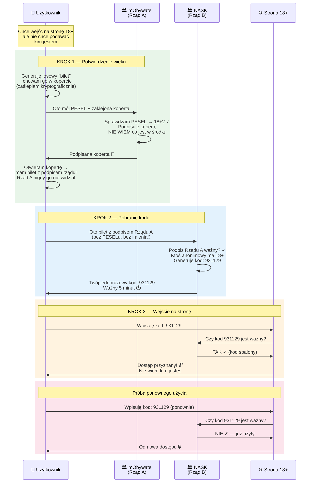
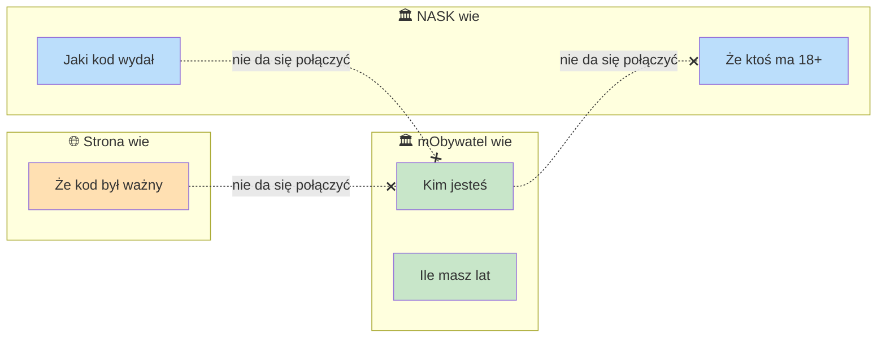

# Anonimowa Weryfikacja Wieku

System pozwala udowodnić stronie internetowej, że masz 18+ lat, **bez ujawniania kim jesteś**.

## Jak to działa?

Trzy podmioty, z których **żaden nie wie wszystkiego**:

| Kto | Co wie | Czego nie wie |
|-----|--------|---------------|
| **mObywatel** (Rząd A) | Kim jesteś i ile masz lat | Jakiego kodu użyjesz ani gdzie |
| **NASK** (Rząd B) | Że ktoś anonimowy ma 18+ | Kim jest ta osoba |
| **Strona 18+** | Że wpisany kod jest ważny | Kim jest użytkownik |

## Przepływ krok po kroku



## Dlaczego to jest bezpieczne?



**Nawet gdyby oba urzędy połączyły swoje dane** — matematycznie nie da się powiązać osoby z kodem, ponieważ "koperta" (blind signature) sprawia, że podpisany bilet wygląda zupełnie inaczej niż to, co widział mObywatel.

## Analogia z życia codziennego

> Wyobraź sobie, że wkładasz kartkę do **nieprzezroczystej koperty z kalką**. Urzędnik sprawdza Twój dowód, podpisuje kopertę (podpis przechodzi przez kalkę na kartkę). Otwierasz kopertę — masz kartkę z podpisem urzędnika, ale **urzędnik nigdy nie widział co było na kartce**. Pokazujesz kartkę w innym okienku, dostajesz kod. Drugie okienko wie, że podpis jest prawdziwy, ale **nie wie kto stał w pierwszym okienku**.

## Uruchomienie demo

```bash
python3 age_verification_poc.py
```

Wymagania: Python 3.8+ (bez zewnętrznych bibliotek).
