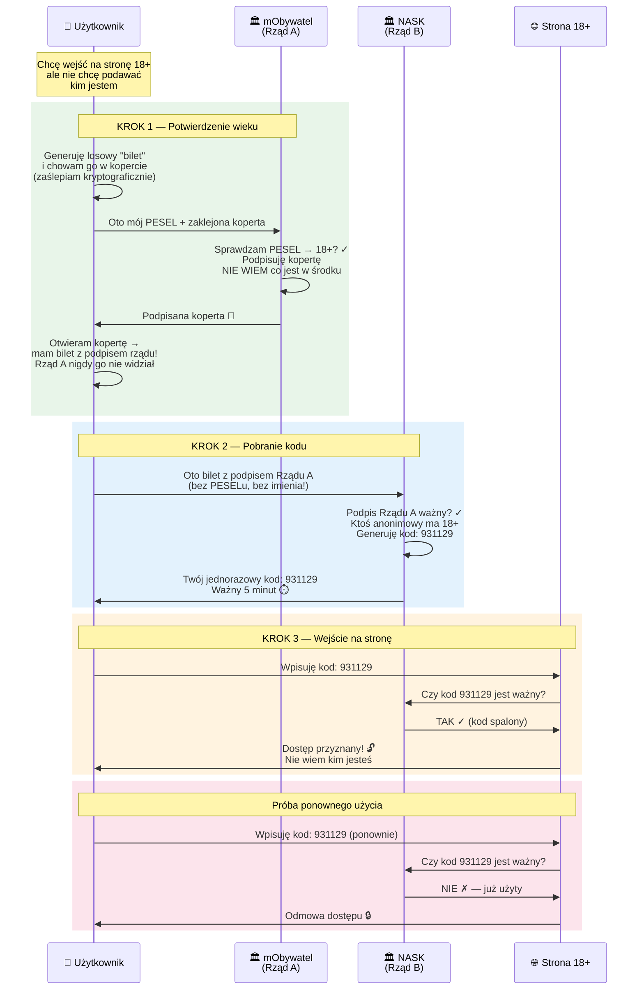
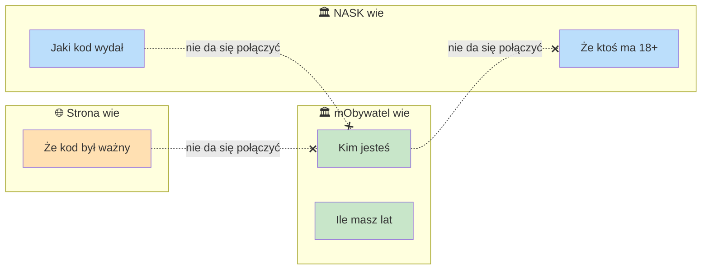
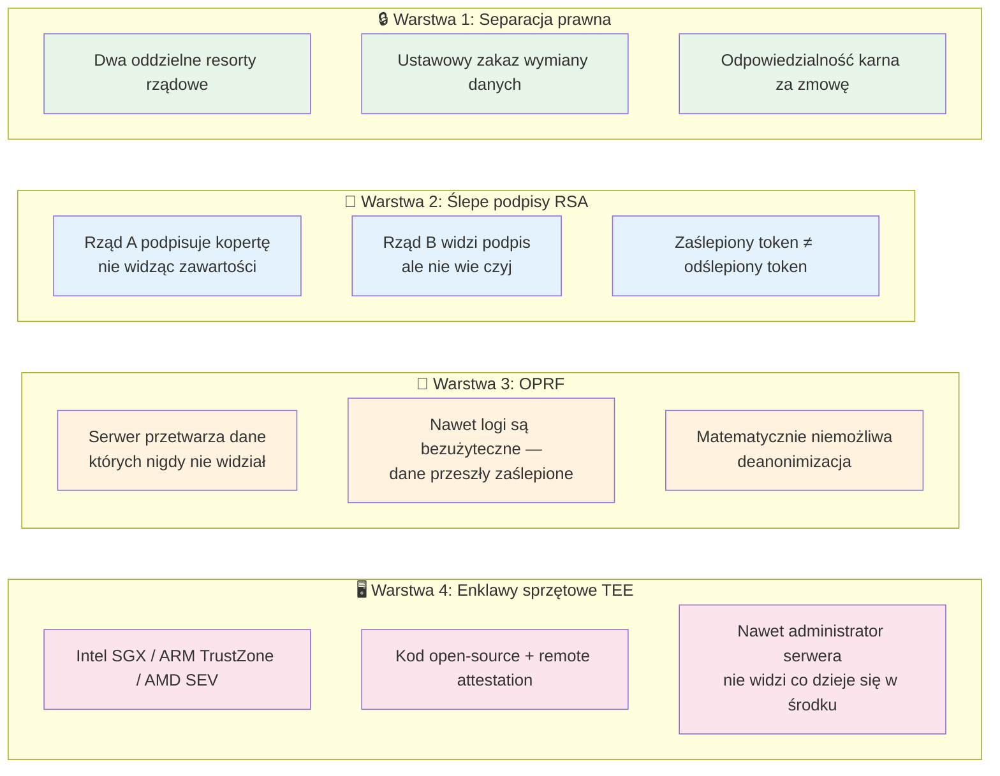

# Anonimowa Weryfikacja Wieku

System pozwala udowodnić stronie internetowej, że masz 18+ lat, **bez ujawniania kim jesteś**.

## Jak to działa?

Trzy podmioty, z których **żaden nie wie wszystkiego**:

| Kto | Co wie | Czego nie wie |
|-----|--------|---------------|
| **mObywatel** (Rząd A) | Kim jesteś i ile masz lat | Jakiego kodu użyjesz ani gdzie |
| **NASK** (Rząd B) | Że ktoś anonimowy ma 18+ | Kim jest ta osoba |
| **Strona 18+** | Że wpisany kod jest ważny | Kim jest użytkownik |

## Przepływ krok po kroku



## Dlaczego to jest bezpieczne?



**Nawet gdyby oba urzędy połączyły swoje dane** — matematycznie nie da się powiązać osoby z kodem, ponieważ "koperta" (blind signature) sprawia, że podpisany bilet wygląda zupełnie inaczej niż to, co widział mObywatel.

## Warstwy ochrony prywatności

System nie polega na jednym mechanizmie — stosuje **cztery niezależne warstwy**, z których każda samodzielnie chroni użytkownika. Żeby deanonimizować kogokolwiek, trzeba by złamać **wszystkie naraz**.



### Warstwa 1: Separacja architektoniczna + prawna

Dwa oddzielne systemy rządowe, prowadzone przez **różne resorty** (np. Ministerstwo Cyfryzacji i NASK), z **ustawowym zakazem wymiany danych** — tak jak dziś tajemnica skarbowa i tajemnica lekarska istnieją w ramach tego samego państwa, ale łamanie bariery między nimi jest przestępstwem.

- **Podmiot A** (np. MC) weryfikuje wiek
- **Podmiot B** (np. NASK) wydaje kody
- Komunikują się **wyłącznie przez ślepy podpis** — A podpisuje nie widząc co, B widzi podpis ale nie wie czyj

> Ograniczenie: wymaga zaufania instytucjonalnego. Zmowa jest nielegalna, ale technicznie możliwa — dlatego potrzebujemy kolejnych warstw.

### Warstwa 2: Ślepe podpisy RSA

Nawet gdyby oba resorty **chciały** połączyć dane, zaślepiony token który widział Rząd A wygląda zupełnie inaczej niż odślepiony token który widzi Rząd B. Matematycznie nie da się ich ze sobą powiązać bez znajomości losowego czynnika zaślepiającego, który zna **wyłącznie użytkownik**.

### Warstwa 3: Nieświadoma Funkcja Pseudolosowa (OPRF)

To jest najsilniejsza warstwa. Oba systemy mogą stać **na tych samych serwerach rządowych**, a i tak matematycznie nie da się powiązać użytkownika z kodem.

Jak to działa:
1. Serwer B ma swój sekretny klucz `k`
2. Użytkownik wysyła **zaślepioną** wartość
3. Serwer przetwarza ją kluczem `k` — ale **nie widzi ani wejścia, ani wyjścia**
4. Użytkownik odślepia wynik i dostaje deterministyczny token

Serwer B wykonał obliczenie na danych, **których nigdy nie widział**. Nawet gdyby ktoś z B chciał deanonimizować — nie ma czego logować, bo dane przeszły w formie kryptograficznie zaślepionej.

### Warstwa 4: Enklawy sprzętowe (TEE)

Podmiot B może dodatkowo działać w **enklawie sprzętowej** (Intel SGX / ARM TrustZone / AMD SEV):

- Kod jest **open-source** i publicznie audytowalny
- Uruchamia się w sprzętowej enklawie z **remote attestation** — każdy może zweryfikować, że działa dokładnie ten kod i nic innego
- **Nawet administrator serwera, nawet minister, nawet ABW z fizycznym dostępem do maszyny** nie mogą podejrzeć co się dzieje w środku

### Rekomendacja: wszystkie warstwy razem

To jest podejście "pasek i szelki":

| Warstwa | Co gwarantuje | Rodzaj gwarancji |
|---------|---------------|------------------|
| **Separacja prawna** | Wymiana danych = przestępstwo | Prawna |
| **Ślepe podpisy** | Nie da się powiązać tokenów | Matematyczna |
| **OPRF** | Serwer nie widzi przetwarzanych danych | Matematyczna |
| **TEE** | Kod robi dokładnie to co deklaruje | Sprzętowa |
| **Open-source** | Brak ukrytych backdoorów | Społeczna (audyt) |

**Nawet jeśli jedno zabezpieczenie zawiedzie, pozostałe trzymają.** Żeby deanonimizować użytkownika, trzeba by **jednocześnie**: złamać matematykę OPRF, zhackować enklawę sprzętową, obejść audyt open-source i złamać prawo. To jest praktycznie niemożliwe.

## Analogia z życia codziennego

> Wyobraź sobie, że wkładasz kartkę do **nieprzezroczystej koperty z kalką**. Urzędnik sprawdza Twój dowód, podpisuje kopertę (podpis przechodzi przez kalkę na kartkę). Otwierasz kopertę — masz kartkę z podpisem urzędnika, ale **urzędnik nigdy nie widział co było na kartce**. Pokazujesz kartkę w innym okienku, dostajesz kod. Drugie okienko wie, że podpis jest prawdziwy, ale **nie wie kto stał w pierwszym okienku**.

## Uruchomienie demo

```bash
python3 age_verification_poc.py
```

Wymagania: Python 3.8+ (bez zewnętrznych bibliotek).
